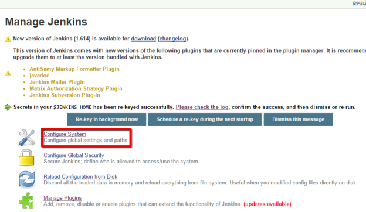
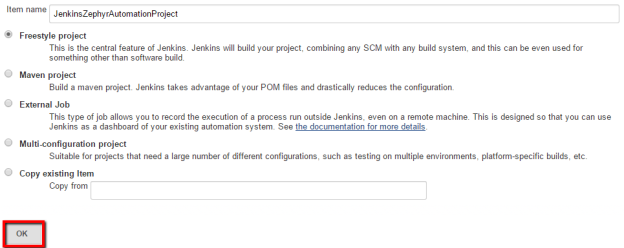
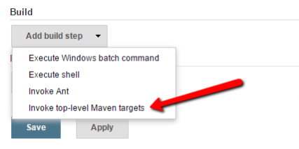
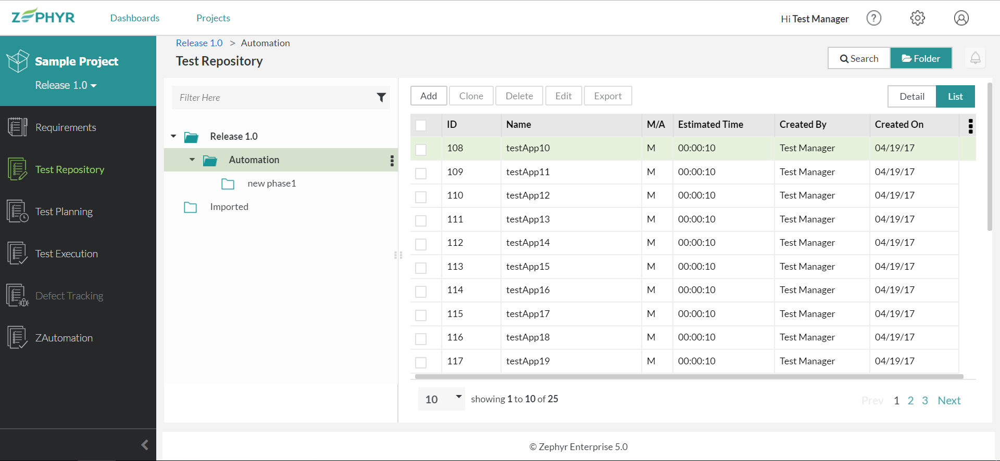
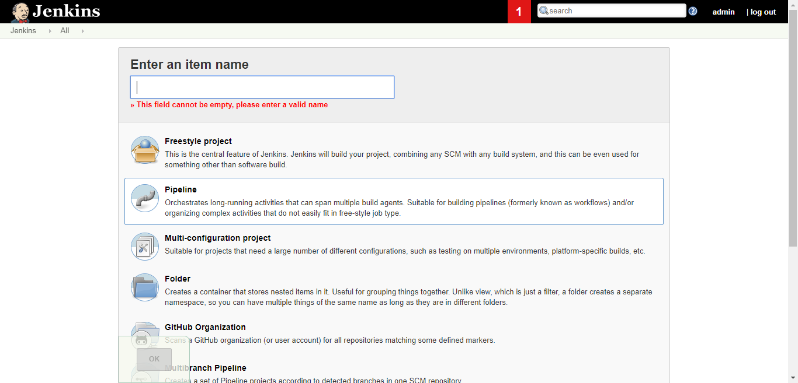
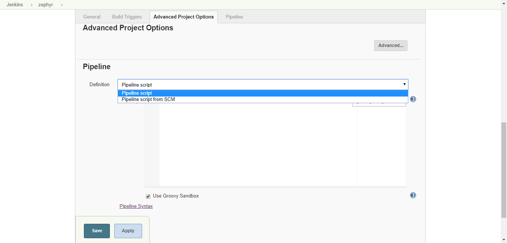
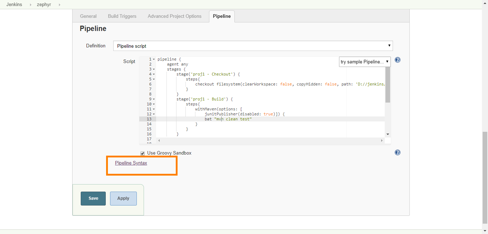

Creates test cases and publishes test results in
[Zephyr](http://www.getzephyr.com) Enterprise for JUnit
test cases

Older versions of this plugin may not be safe to use. Please review the
following warnings before using an older version:

-   [CSRF vulnerability and missing permission check allow
    SSRF](https://jenkins.io/security/advisory/2019-04-03/#SECURITY-993)


## **About the Plugin**

Zephyr Enterprise Test Management Plugin for Jenkins integrates Jenkins
and Zephyr Enterprise Edition / Zephyr Community Edition. This plugin
creates test cases and publishes test results in Zephyr Enterprise for
JUnit test cases in Jenkins. It supports publishing maven surefire
format test results (JUnit and TestNG).
This guide will cover how to create and execute test cases automatically
in Zephyr Enterprise using this plugin; this includes

1.  Downloading and installing the plugin
2.  Adding Zephyr Severs in the Jenkins global settings.
3.  Configuring a standard Jenkins Job.
4.  Configuring Zephyr Enterprise Test Management Plugin as a post-build
    action.
5.  Triggering the job and publishing results in Zephyr

## **Requirements**

1.  Zephyr Enterprise 6.X
2.  Jenkins installation (v2.62 or later)

## **Adding Zephyr Servers in Jenkins global settings**

After installation configure Jenkins global settings to establish
connection with Zephyr Server(s). Follow the below steps

-   Launch Jenkins and access via a web browser.
-   Click on "Manage Jenkins" from the Menu as illustrated in the below
    screenshot.


-   Click on "Configure System".




-   Locate the section "Zephyr Server Configuration" and click "Add".
    You can add more than one Zephyr Server by clicking on "Add" button.


-   Enter Zephyr Server URL and add credentials by clicking on add. Note that the user
    credentials must be that of Zephyr "Test Manager" or "Test Lead".


-   Select credentials to be used from the drop-down.


-   Click on "Test Configuration" to validate connection to Zephyr
    Server.


-   Click on "Save" button to save the configuration changes.


# **Configuring a standard Jenkins job**

A job in Jenkins defines a sequence of tasks for Jenkins to perform.
When a job is triggered, Jenkins looks for an Ant script or Maven build
file and runs it. It also provides options to define post-build tasks.
Follow the example below to configure a standard job and add a post
build action:

1\. Create a new Jenkins job by clicking the "New Item" link found on the
menu.


2\. Give a name for your job, check the box "Freestyle project" and click
on "OK" button.



3\. To configure the job you just created, click the \<job name\> on the
Jenkins home page.


4\. Click the "Configure" link.


5\. Choose "Subversion" option in the "Source Code Management" section.


6\. Enter the subversion URL where the target project resides and press
Tab.


Note: User credentials needs to be setup to access SVN server. Click on
"enter credential" link to set it up if you see below error.


7\. To add a build step, locate the "Build' section and select "Invoke
top-level maven targets" from the "Add build step" dropdown.



8\. Select "clean package" as your Goals.


**9. The plugin requires JUnit test result**. Locate the "Post-build
Actions" section and select "Publish JUnit test result report" from "Add
post-build Actions" dropdown.


10\. Enter the path to the test report. In the example below the location
is "Proj1\\target\\surefire-reports/\*.xml" where Proj1 is the target
project.


# **Configuring Zephyr Enterprise Test Management plugin as a post-build action**


In order to publish results in Zephyr, define another post-build action.

1\. Select "Publish test result to Zephyr Enterprise" from "Add
post-build Actions" dropdown.


2\. Configure Zephyr plugin job.


1.  1.  1.  Select the Zephyr URL from the dropdown. (Servers configured
            in the Jenkins global configuration are available here to
            select). This automatically pulls in Zephyr projects,
            releases and cycles.
        2.  Select the Project Name from the dropdown. This re-populates
            the releases.
        3.  Select the Release from the dropdown. Selecting a release
            fetches all its cycles.
        4.  Select either an existing Cycle from the dropdown or create
            a new cycle.
        5.  For existing Cycle the default Cycle Duration will be that
            of existing cycle in Zephyr and Cycle Name Prefix will be of
            the format "Automation\_\<Date\>\<Time\>" stamp.
        6.  For new cycle you have option to select Cycle Duration from
            the dropdown and to edit default cycle prefix name
            "Automation". In the absence of a cycle prefix name
            "Automation" is used for new cycles.
        7.  To create a package structure while creating and organizing
            the test cases, check the box "Create Package Structure".
        8.  Click "Save".


**Triggering the job and publishing results in Zephyr**

To trigger a job manually, click "Build Now" link on the menu. This
builds the project and publishes the JUnit result.


In Zephyr Enterprise Jenkins creates a phase named "Automation" along
with package structure of the JUnit test cases found in the project.



Finally, Jenkins assigns this phase to the selected cycle and executes
all the tests in Zephyr.


# **Configuring a pipeline Jenkins job**

1. Select Pipeline project in new item instead of freestyle project while creating project.


2. In configure section select pipeline script option.


3. Copy pipeline script in script section.

4. Click on pipeline syntax.


5. Select Junit: Archive-JUnit Formatted test results and add tartget XML file → Click on Generate Pipeline Script.


6. Select zeeReporter: Publish test result to Zephyr Enterprise → Enter all details.


7. Click on Generate Pipeline Script → Copy generated pipeline script.


8. Paste copied pipeline script to script section in configure.
Changes in pipeline script
    -   Add path of project in this line checkout filesystem(clearWorkspace: false, copyHidden: false, path: 'D://jenkins//Proj1-10')
    -   Add copied script of junit target file under post  junit 'target/surefire-reports/*.xml'
    -   Add copied script from zee reporter
    -   Use bat if we configured with windows or sh if we configured with Linux

**Sample script**
```
pipeline {
    agent any
        stages {
            stage('proj1 - Checkout') {
                steps{
                    checkout filesystem(clearWorkspace: false, copyHidden: false, path: 'D://jenkins//Proj1-10')
                }
            }
            stage('proj1 - Build') {
                steps{
                    withMaven(options: [
                    junitPublisher(disabled: true)]) {
                        bat "mvn clean test"
                    }
                }
            }
        }
        
    post {
        always{
            junit 'target/surefire-reports/*.xml'
            zeeReporter createPackage: false, cycleDuration: '1 day', cycleKey: '1', cyclePrefix: 'zxcvbnm<12#%^>', projectKey: '4', releaseKey: '7', serverAddress: 'http://10.16.2.25'
        }
    }
}
```


9. Trigger the build.

# **License**

This plugin is open source. It follows the Apache License version 2.0
(\<<http://www.apache.org/licenses/>\>). It means:
It allows you to:

-   freely download and use this software, in whole or in part, for
    personal, company internal, or commercial purposes;
-   use this software in packages or distributions that you create.

It forbids you to:

-   redistribute any piece of our originated software without proper
    attribution;
-   use any marks owned by us in any way that might state or imply that
    we [www.getzephyr.com](http://www.getzephyr.com)
    endorse your distribution;
-   Use any marks owned by us in any way that might state or imply that
    you created this software in question.

It requires you to:

-   include a copy of the license in any redistribution you may make
    that includes this software;
-   provide clear attribution to us,
    [www.getzephyr.com](http://www.getzephyr.com) for
    any distributions that include this software

It does not require you to:

-   include the source of this software itself, or of any modifications
    you may have made to it, in any redistribution you may assemble that
    includes it;
-   Submit changes that you make to the software back to this software
    (though such feedback is encouraged).

See License FAQ \<<http://www.apache.org/foundation/licence-FAQ.html>\>
for more details.

# **Feedback**

-   Please provide feedback at [JENKINS
    JIRA](https://issues.jenkins-ci.org/projects/JENKINS)
    or at [Zephyr
    Community](https://support.getzephyr.com/hc/communities/public/topics/200179869-Developer-Zone-Zephyr-Enterprise-Community)
-   For code questions, send an email to
    [developer@getzephyr.com](https://wiki.jenkins.io/display/JENKINS/mailto:developer%40getzephyr.com)
